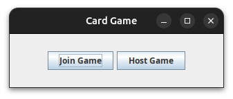
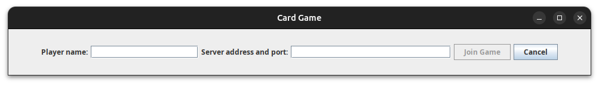
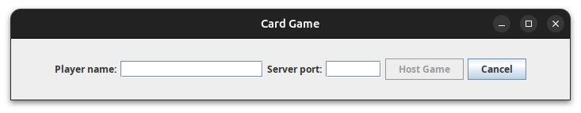
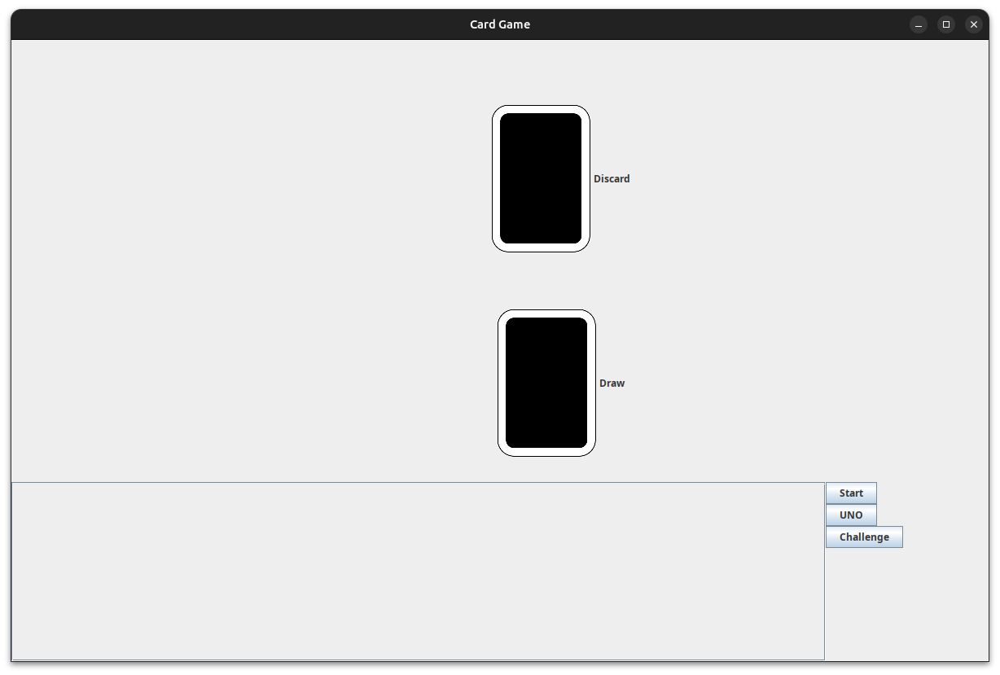
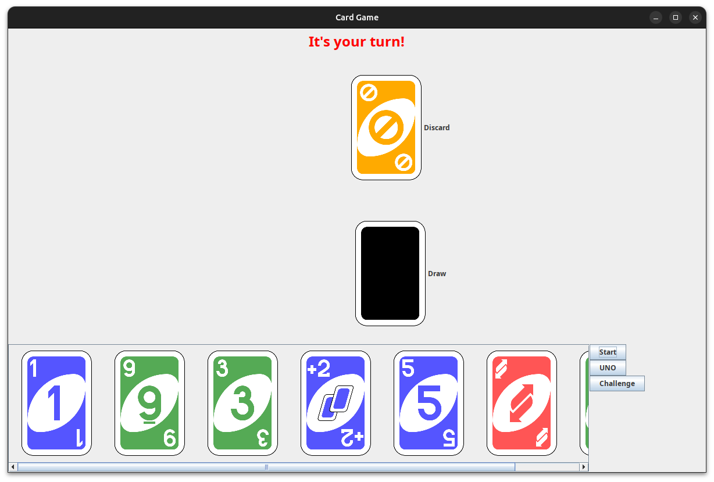

# User manual

**Table of contents**
- [Main menu](#main-menu)
- [Join game menu](#join-game-menu)
- [Host game menu](#host-game-menu)
- [Game](#game)

## Main menu

The main menu allows the user to choose from two options by pressing two dedicated buttons:
1. Join game
2. Host game

The option's corresponding menu will load upon clicking the button.

## Join game menu

The join game menu allows the user to choose a player name and specify a server they want to connect to. 

The server address must be a valid IPv4 address and a valid port number separated by a ':'. The player name's length must be at least 1 and at most 16.

The cancel button takes the user back to the main menu.

The join button becomes clickable only when both the player name and the server address has been supplied and both are valid.

Upon clicking the join button the player connects to the server and the game is loaded.

## Host game menu

The host game menu allows the user to choose a player name and specify a port on which the server will be opened. 

The server port must be a valid port number. The player name's length must be at least 1 and at most 16.

The cancel button takes the user back to the main menu.

The host button becomes clickable only when both the player name and the server port has been supplied and both are valid.

Upon clicking the host button a server is started on the port and the player id connected to the server and the game is loaded.

## Game

The player can interact with the game through this GUI. When the game isn't started yet the GUI should look like this:

The host player can start the game by pressing the 'Start' button. After starting the game the GUI should look similar to this:

On the top of the window there is a turn indicator which tells the player if it's their turn now.

On the left the other players' informations are displayed (if there are other players).

On the bottom the player can see their own cards. Clicking on a card discards the card (only if it's a legit move).

If the player can't discard any card, they can draw a card by clicking on the card named 'Draw' on the center.

If the player has only one card left they can say UNO by clicking the 'UNO' button.

If the previous player has played a wild draw four card the player can challenge them by clicking the 'Challenge' button.

When a player wins the game a pop up message is shown. Clicking 'OK' closes the application.